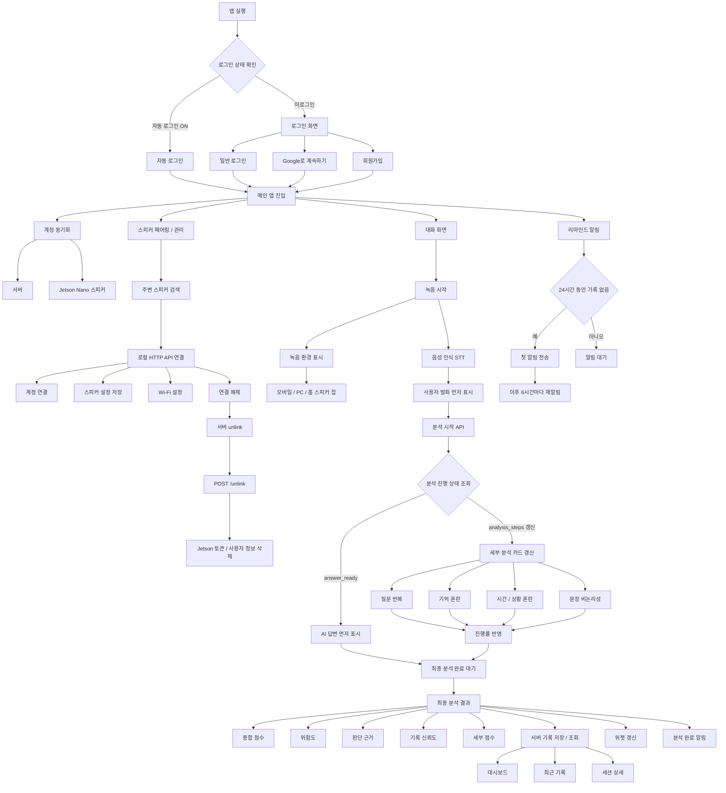

```mermaid
flowchart TD
    A["앱 실행"] --> B{"로그인 상태 확인"}

    B -->|자동 로그인 ON| C["자동 로그인"]
    B -->|미로그인| D["로그인 화면"]
    D --> D1["일반 로그인"]
    D --> D2["Google로 계속하기"]
    D --> D3["회원가입"]
    C --> E["메인 앱 진입"]
    D1 --> E
    D2 --> E
    D3 --> E

    E --> F["계정 동기화"]
    F --> S["서버"]
    F --> J["Jetson Nano 스피커"]

    E --> G["스피커 페어링 / 관리"]
    G --> G1["주변 스피커 검색"]
    G1 --> G2["로컬 HTTP API 연결"]
    G2 --> G3["계정 연결"]
    G2 --> G4["스피커 설정 저장"]
    G2 --> G5["Wi-Fi 설정"]
    G2 --> G6["연결 해제"]
    G6 --> S1["서버 unlink"]
    S1 --> J1["POST /unlink"]
    J1 --> J2["Jetson 토큰 / 사용자 정보 삭제"]

    E --> H["대화 화면"]
    H --> I["녹음 시작"]
    I --> I1["녹음 환경 표시"]
    I1 --> I2["모바일 / PC / 홈 스피커 칩"]
    I --> K["음성 인식 STT"]
    K --> L["사용자 발화 먼저 표시"]

    L --> M["분석 시작 API"]
    M --> N{"분석 진행 상태 조회"}

    N -->|answer_ready| O["AI 답변 먼저 표시"]
    N -->|analysis_steps 갱신| P["세부 분석 카드 갱신"]

    P --> P1["질문 반복"]
    P --> P2["기억 혼란"]
    P --> P3["시간 / 상황 혼란"]
    P --> P4["문장 비논리성"]

    P1 --> Q["진행률 반영"]
    P2 --> Q
    P3 --> Q
    P4 --> Q

    O --> R["최종 분석 완료 대기"]
    Q --> R

    R --> T["최종 분석 결과"]
    T --> T1["종합 점수"]
    T --> T2["위험도"]
    T --> T3["판단 근거"]
    T --> T4["기록 신뢰도"]
    T --> T5["세부 점수"]

    T --> U["서버 기록 저장 / 조회"]
    U --> V["대시보드"]
    U --> W["최근 기록"]
    U --> X["세션 상세"]
    T --> Y["위젯 갱신"]
    T --> Z["분석 완료 알림"]

    E --> RMD["리마인드 알림"]
    RMD --> RMD1{"24시간 동안 기록 없음"}
    RMD1 -->|예| RMD2["첫 알림 전송"]
    RMD2 --> RMD3["이후 6시간마다 재알림"]
    RMD1 -->|아니오| RMD4["알림 대기"]
```
